# OIDC Server Setup

## OKTA SETUP

### OKTA OIDC SETUP

1. After login to your OKTA account, if it show this page, click admin button.  

2. Go to the application page and click “Create App Integration” to create a new application.  

3. Select “OIDC - OpenID Connect” in the Sign-in method section and “Single-Page Application” at the Application Type section.  

4. Change the application name as you like and you can upload a logo for this application.  

5. Change the sign-in redirect url in the following format. Change the field in bracket to relative field. For example, this is one of the urls used in development eg(http://localhost:8000/o/{org_id}/sso/oidc/{idp_name}/login/callback)
If you are using an enterprise plan, this is the callback url for it. eg(http://localhost:8000/g/sso/oidc/{idp_name}/login/callback)  

6. Choose “Skip group assignment for now” and save the changes. We will assign the user/group later.  

7. Record the field named “Client ID”, and “Okta domain”. We have to use these fields to register an Organization SSO ID Provider in graphistry.  

8. Assign persons to application.  

9. Click the “Assign” same line with the person to assign the application to it.  
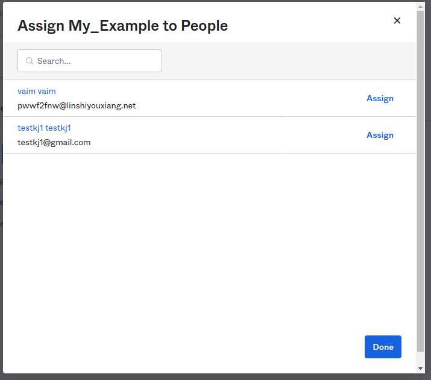
10. Click the “Assign” same line as group to assign group to it. If assigned by group, all people in the group can login to this application.  
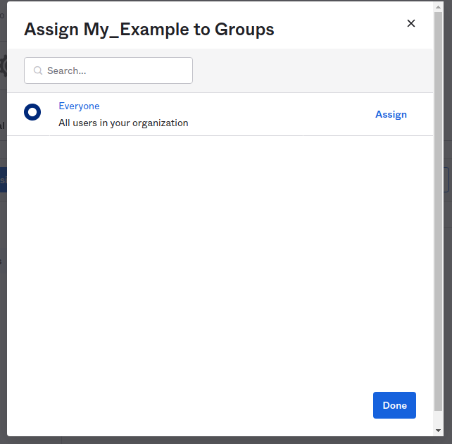

### OKTA PEOPLE SETUP

1. Create new people.  

2. Fill in the relative field.If the Activation is set to "Activate later", users will receive an email to set their password and activate the account.  

3. If the Activation is set to "Activate now", it will show some options for setting the password. If the "I will set password" option is ticked, you can enter a temporary password and can specify user to change their password after first login or not.  

### OKTA GROUP SETUP

1. Create a new Group.  
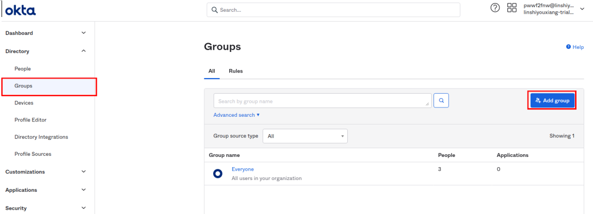
2. Give a name to the group and add description if you want to.  

3. Click the group name you create to manage the group.  
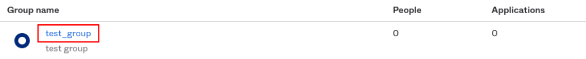
4. Click the "Assign people" to add person to the group by clicking the person. You also can remove user from group by click "remove".  
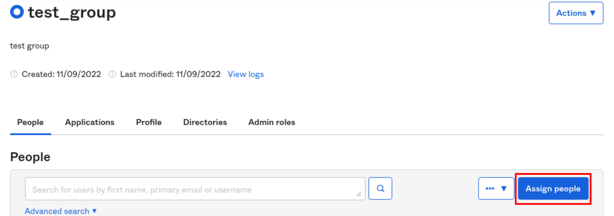

## AUTH0 SETUP

### AUTH0 OIDC SETUP

1. After signing an account for Auth0, select “Company” as the account type so you can limit the person who can log in to this organization. Fill in the company name and select size for company.  
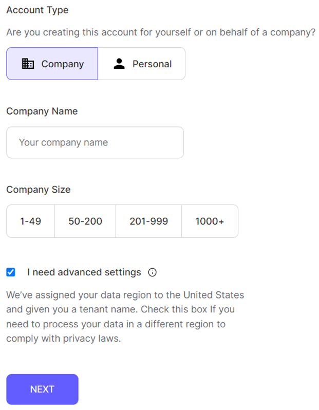
2. You can change the domain name and choose the country you want. Change of country will change the host url.  

3. Click the “Application” in the Application section to go to the application page. Click “Create Application” to create a new application.  
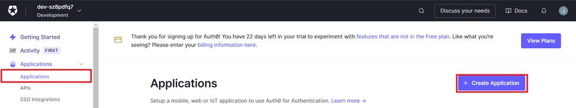
4. Name your application and select “Single Page Web Applications”.  

5. Go to “Settings” to get “Domain”, “Client ID” and “Client Secret”.  We have to use these fields to register an Organization SSO ID Provider in graphistry.  

6. Change the sign-in redirect url in the following format. Change the field in bracket to relative field. For example, this is one of the urls used in development http://localhost:8000/o/admin/sso/oidc/test_admin/login/callback/ 
If you are using an enterprise plan, this is the callback url for it. http://localhost:8000/g/sso/oidc/Site_wide_SSO_Provider/login/callback/  
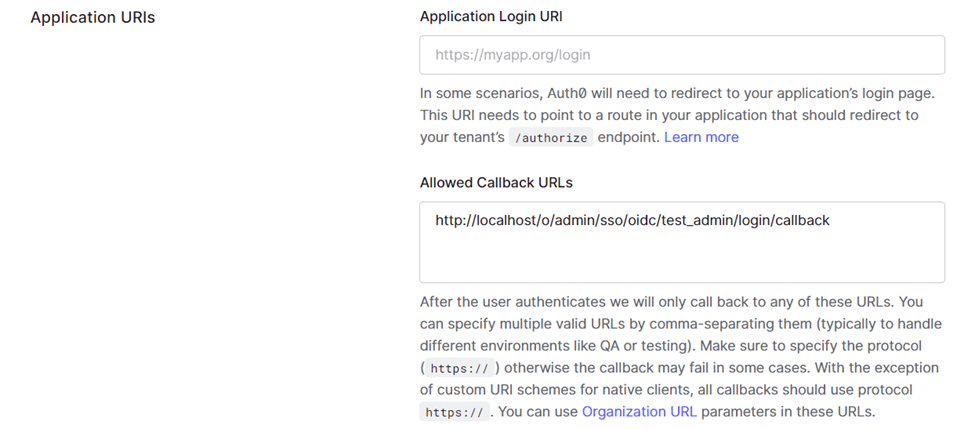
7. Save changes after completing add callback urls.  
8. Disable grants to use organization function.  

9. Change the Organization setting to “Team members of organizations” and click “Save Changes“.  

### AUTH0 USER SETUP

1. Go to ”User Management” and select the user to go to the user page. Click “Create User” to create a new user.  
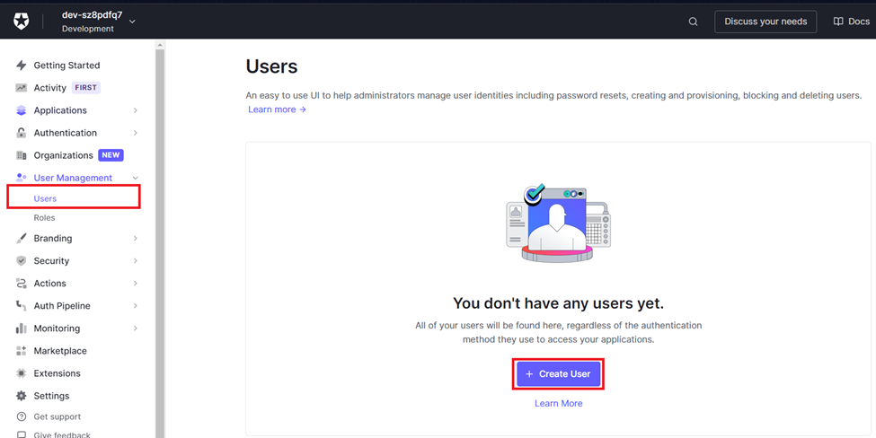
2. Fill in all of the fields and click “Create” to create a new user.  

### AUTH0 ORGANIZATION SETUP

1. Go to “Organizations” and click “Create Organization” to create a new organization.  
	
2. Name your organization and a name displayed.  
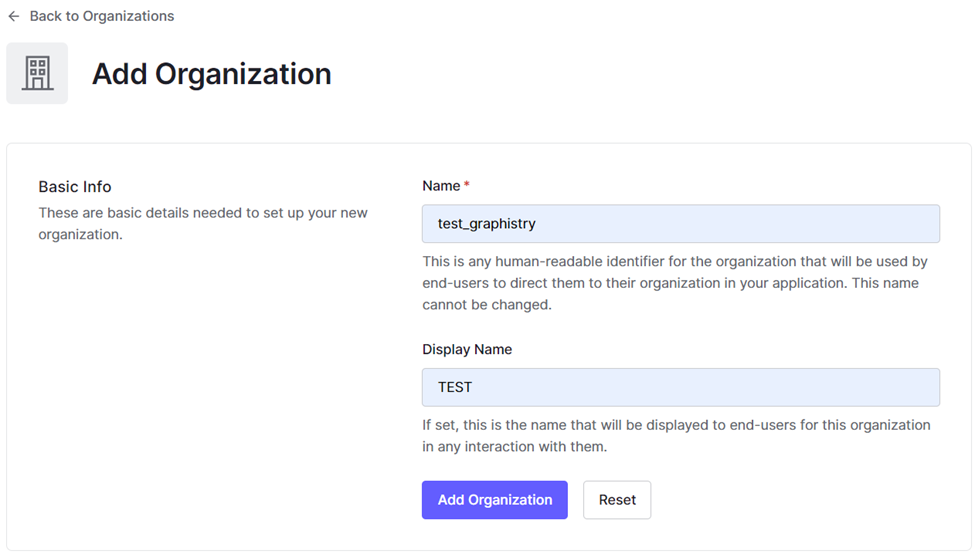	
3. Please record this “Organization ID” because this ID has to use when create org sso id provider.  
	
4. You can change these fields to adjust thein UI the login page. Save changes if you change anything.  
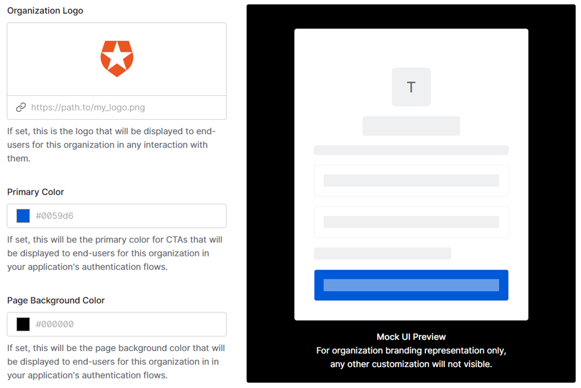	
5. Go to the “Member” session and click “Add Members” to add members to your organization.  
	
6. After selecting the user you want to add, click “Add Member” to add them to the organization.  
	
7. Go to "Connections" session and click "Enable Connections" to add connections to organization.  
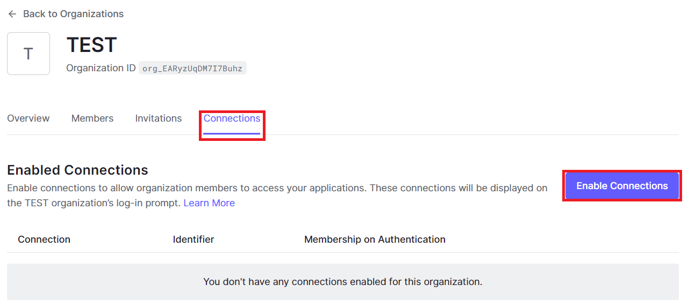	
8. Select "Username-Password-Authentication" and click "Enable Connection".  
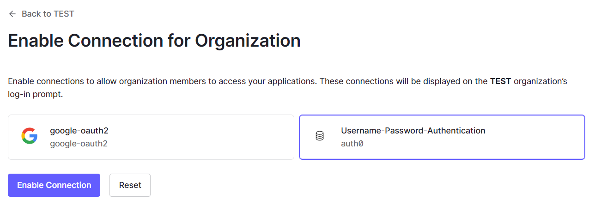	

## KEYCLOAK SETUP (No PKCE)

### KEYCLOAK OIDC SERVER SETUP

1. Login to the keycloak admin console. Default username is “admin” and passwords is “graphistry”.  
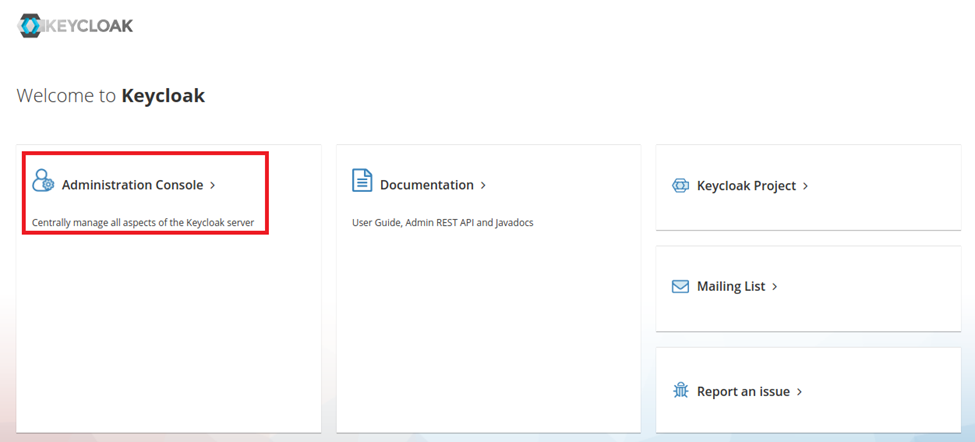	
2. Create a new realm for OIDC server. Move your mouse cursor to “Master” and the “add realm” button will show up.  
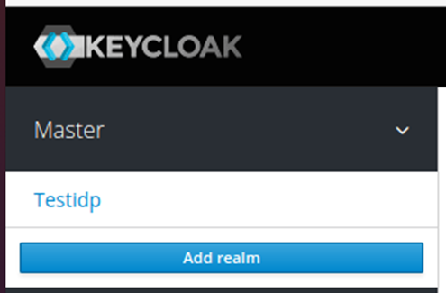	
3. Add a name to this realm. We will take this realm name as idp name when you create an OrgSSO object.  
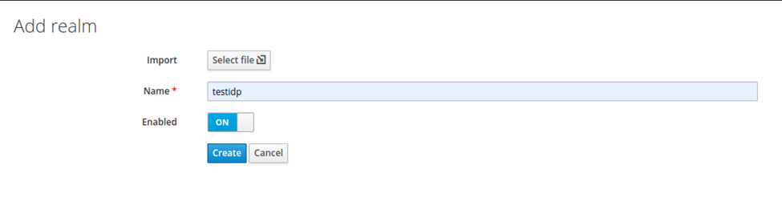	
4. After realm creation success, go to the “clients” section and click “create” to create a new client for OIDC.  
	
5. Fill in “client id” for and this client id is the Client ID you have to use when create OrgSSO object.  
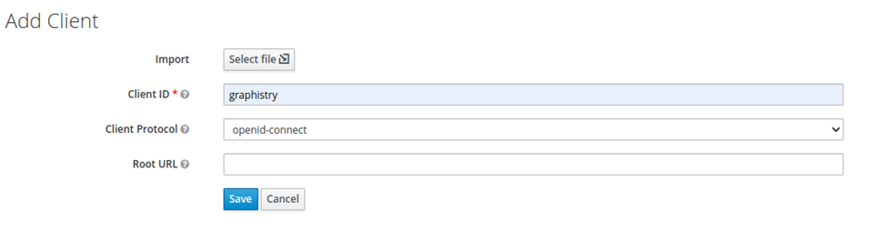
6. Change the “Access type” from public to confidential. Add valid Redirect URls to it. For example, http://localhost/* , the * means it will take anything after the host.  
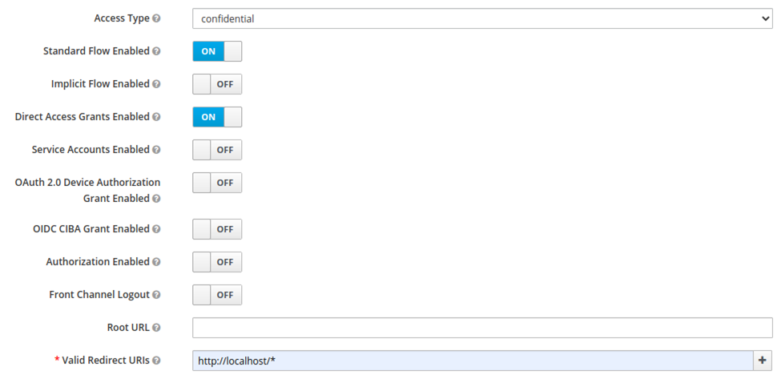
7. Go to “Credentials” to get the secret key.  
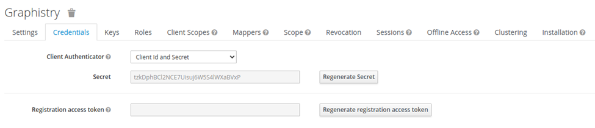

### KEYCLOAK USER SETUP
1. Go to the “User” section and click “add user”.  
	
2. Fill in the info when you create a user. Only username attribute is required. For the “Required User Actions” attribute, you can choose the action for the user to verify their email or update password for the first time they login.  

3. Go to the “Credentials” section, create a password for this user so they can log in to this server. If you toggle on the “Temporary”, users have to update the password for the first time they login.  

