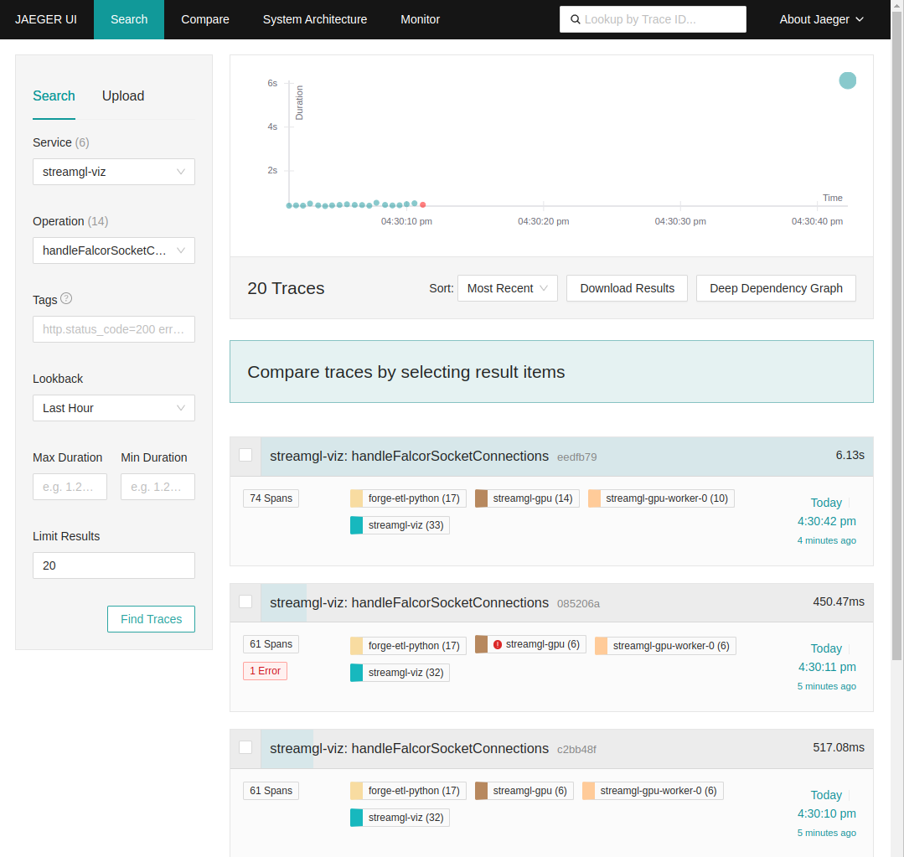
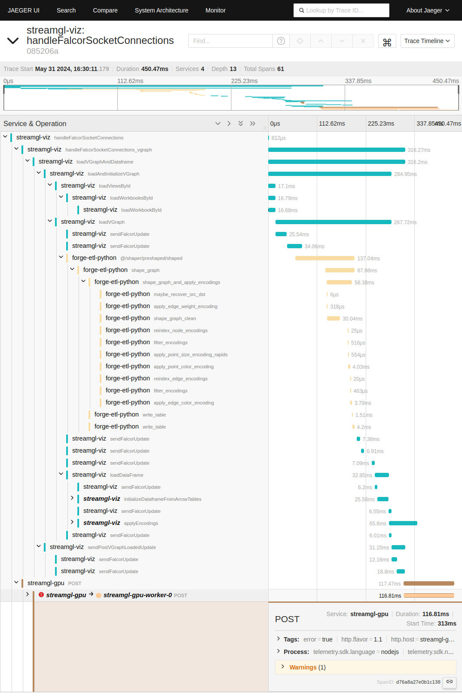

# Telemetry

## Overview

Graphistry services export telemetry information (metrics and traces) using the [OpenTelemetry](https://opentelemetry.io/) standard.

Graphistry services push their telemetry data to the [opentelemetry-collector](https://opentelemetry.io/docs/collector/) service (alias `otel-collector`) and this will forward the data to any observability tool that is compatible with the OpenTelemetry standard (e.g. Prometheus, Jaeger, Grafana Cloud, etc.).

Graphistry can be deployed alongside the packaged Graphistry Local Telemetry Suite, which includes Prometheus, Jaeger, and Grafana services.

## Usage

By default, the telemetry services are disabled. To enable, set `ENABLE_OPEN_TELEMETRY=true` in `$GRAPHISTRY_HOME/data/config/telemetry.env`.

The `./release` script in $GRAPHISTRY_HOME will automatically start those services when `ENABLE_OPEN_TELEMETRY=true`.  The `./release` script is anologous to `docker compose ...`, but will not trigger telemetry collection, forwarding, nor telemetry UIs unless ENABLE_OPEN_TELEMETRY is set to true and the services are properly configured. 

To start the otel services, run:
```
cd $GRAPHISTRY_HOME
./release up -d
```

Once the services are online, we can access these links for development and operations:

* OTEL Collector metrics for Prometheus: https://$GRAPHISTRY_HOST/metrics
* Prometheus dashboard: https://$GRAPHISTRY_HOST/prometheus/
* Jaeger dashboard: https://$GRAPHISTRY_HOST/jaeger/
* Grafana dashboard: https://$GRAPHISTRY_HOST/grafana/ (including GPU metrics and dashboard from NVIDIA Data Center GPU Manager: `DCGM Exporter Dashboards`)

## Configuration

### telemetry.env

The file `$GRAPHISTRY_HOME/data/config/telemetry.env` has the environment variables to enable and configure the telemetry services (including the `opentelemetry-collector`), by default, the file is either commented out or empty, so by default Graphistry does not collect and export OpenTelemetry data.
These are the core environment variables:

- `ENABLE_OPEN_TELEMETRY`: Supports `true` or `false`.  After setting this to `true` and restarting the deployment with `./release up -d` the telemetry services will be started and the Graphistry services will export telemetry data.
- `OTEL_COMPOSE_FILE`: Indicates which telemetry services will be deployed along the Graphistry services.  Possible values are `telemetry.cloud.yml` (e.g. when we want to export to Grafana) or `telemetry.yml` (e.g. when we want to use the Graphistry Local Telemetry Suite: Prometheus, Jaeger and Grafana instances).

These environment variables are used when we want to use `OTEL_COMPOSE_FILE=telemetry.yml`:
- `OTEL_COLLECTOR_OTLP_HTTP_ENDPOINT`: For example the Grafana Cloud OTLP HTTP endpoint.
- `OTEL_COLLECTOR_OTLP_USERNAME`: For example the Grafana Cloud Instance ID for OTLP
- `OTEL_COLLECTOR_OTLP_PASSWORD`: For example the Grafana Cloud API Token for OTLP

 ### Telemetry services

The `$GRAPHISTRY_HOME/etc` has the directories to configure the Graphistry Local Telemetry Suite:
- `$GRAPHISTRY_HOME/etc/otel-collector`: Has the `otel-collector-config.cloud.yml` (when we use the `OTEL_COMPOSE_FILE=telemetry.cloud.yml`) and `otel-collector-config.yml` (`OTEL_COMPOSE_FILE=telemetry.yml`).
- `$GRAPHISTRY_HOME/etc/prometheus`: Has `prometheus.yml` to configure the Prometheus service.  By default, it is already configured to collect metrics from Graphistry services and from the `DCGM exporter` service.
- `$GRAPHISTRY_HOME/etc/jaeger`: To configure the Jaeger service.
- `$GRAPHISTRY_HOME/etc/grafana`: To configure the Grafana service.  By default, it has already configured the Prometheus service as default datasource.  Also, it has already configured and ready to use the `DCGM Exporter Dashboards`.

## Examples

### Example: Deploying with Graphana Cloud

This is the configuration template for using [Grafana Cloud](https://grafana.com/) alongside the OpenTelemetry Collector:

```bash
ENABLE_OPEN_TELEMETRY=true

OTEL_COMPOSE_FILE=telemetry.cloud.yml

OTEL_COLLECTOR_OTLP_HTTP_ENDPOINT="https://hostname.grafana.net/otlp"   # e.g. Grafana OTLP HTTP endpoint
OTEL_COLLECTOR_OTLP_USERNAME="XYZ"   # e.g. Grafana Cloud Instance ID for OTLP
OTEL_COLLECTOR_OTLP_PASSWORD="PQR"   # e.g. Grafana Cloud API Token for OTLP
```

### Example: Deploying with the Packaged Graphistry Local Telemetry Suite

This is the configuration template for using the Graphistry Local Telemetry Suite alongside the OpenTelemetry Collector:

```bash
ENABLE_OPEN_TELEMETRY=true

OTEL_COMPOSE_FILE=telemetry.yml
```

## Key Telemetry Features

### Tracing
The most critical flow instrumented is the graph rendering flow:
- **Flow Initiation:** Starts in the web browser when opening a dataset URL (example: `http://$GRAPHISTRY_HOST/graph/graph.html?dataset=d9fc0b023278494583a526f0a35771f0`).
- **Root Span Creation:** The visualization service (`streamgl-viz`) creates a root span containing metadata like user ID, dataset ID, and graph session ID.
- **Trace Propagation:** The trace context propagates from the web browser to the GPU workers, which create spans for various actions (e.g., play, read, stop).
- **Data Fetching:** Both the visualization service and GPU workers (`streamgl-gpu`) fetch dataset data from the python ETL service (`forge-etl-python`).

**Use Case:**
- **Error Identification:** The trace information provides a detailed view across the frontend (web browser), visualization service, GPU workers, and the python ETL service, helping identify performance bottlenecks and errors.
- **Bottleneck Identification:** The trace information also provides a some insights about latency issues and other performance problems that may affect the graph redenering flow.

### Metrics
Metrics are implemented for critical errors and service health, where each metric can include lots of useful metadata (user id, graph session id, dataset id, etc.):
- **GPU Workers:** Monitor `worker.read.crashes` counter for crash incidents.
- **Python ETL Service:** Track file uploads and dataset creation activities.

**Use Case:**
- **Error Monitoring:** Increase visibility into critical errors, such as GPU worker crashes.
- **Dataset Monitoring:** Gather insights into ETL operations like file uploads and dataset creations.

### GPU Monitoring with Grafana and NVIDIA Data Center GPU Manager

To provide comprehensive monitoring of GPU performance, we utilize Grafana in conjunction with NVIDIA Data Center GPU Manager (DCGM).  These tools enable real-time visualization and analysis of GPU metrics, ensuring optimal performance and facilitating troubleshooting.
- **NVIDIA Data Center GPU Manager (DCGM):** [DCGM](https://developer.nvidia.com/dcgm) is a suite of tools for managing and monitoring NVIDIA GPUs in data centers.  It provides detailed metrics on GPU performance, health, and utilization.
- **Grafana:** Grafana is an open-source platform for monitoring and observability.  It allows users to query, visualize, alert on, and explore metrics from a variety of data sources, including Prometheus.  By default the Grafana instance has the metrics and GPU dashboard from the `DCGM exporter` service (see `DCGM Exporter Dashboards` in the Grafana main page).


## How to Use the Telemetry Data

When enabled, telemetry sent to the local Graphistry [OTEL Collector](https://opentelemetry.io/docs/collector/) service, and from there, dispatches to any observability tool that is compatible with the OpenTelemetry standard (e.g. Prometheus, Jaeger, Grafana Cloud, etc.).

To use telemetry with Graphistry, you need to:

* Enable telemetry collection recording in one or more Graphistry services
* Configure which users each service will monitor (see section on feature flags)
* Enable the telemetry collector service
* Configure the forwarding from the telemetry collector to an observability database/UI
* Optionally, setup a local observability database/UI

### Accessing Traces

1. **Jaeger Dashboard:** View and analyze traces at `http://$GRAPHISTRY_HOST:16686`.
2. **Key Tracing Information:**
   - List of traces generated by the system for the graph rendering flow (for instance: show the trace list including a trace with errors).

   - The root span for the graph rendering flow is `streamgl-viz: handleFalcorSocketConnections`.
   - The service that generates the root span for the graph rendering flow is `streamgl-viz`.
   - Detailed spans for actions by the visualization service and GPU workers (for instance: inspecting trace with error).

   - ETL dataset fetch spans from the Python ETL Service service.

### Accessing Metrics
1. **Prometheus Dashboard:** Access metrics at `http://$GRAPHISTRY_HOST:9091`.
2. **Critical Metrics to Monitor:**
   - `worker_read_crashes_total`: Monitor GPU worker crashes.
   - File upload and dataset creation metrics in the Python ETL service (all metrics with the name `forge_etl_python_upload_*`, for instance: `forge_etl_python_upload_datasets_request_total`).


## Advanced configuration

### Caddyfile - reverse proxy set up

To acces the telemetry services, you need to use the template file `$GRAPHISTRY_HOME/data/config/Caddyfile.otel-setup` for the caddy configuration.

1. Create a backup copy of you current Caddyfile: `$GRAPHISTRY_HOME/data/config/Caddyfile`.
2. Copy `$GRAPHISTRY_HOME/data/config/Caddyfile.otel-setup` to `$GRAPHISTRY_HOME/data/config/Caddyfile`
3. Change your-domain.grph.xyz for your domain inside the caddy file `$GRAPHISTRY_HOME/data/config/Caddyfile`.
3. restart caddy with:
```
cd $GRAPHISTRY_HOME
./release up -d --force-recreate caddy
```

### Audience selection via feature flags

The feature flag in the web admin panel (waffle) for OpenTelemetry is `flag_ot_traces`, and it is off by default

You need to be admin in order to change its value, this flag controls at runtime which users can export telemetry data.  You can set monitoring to no/all/select users.
