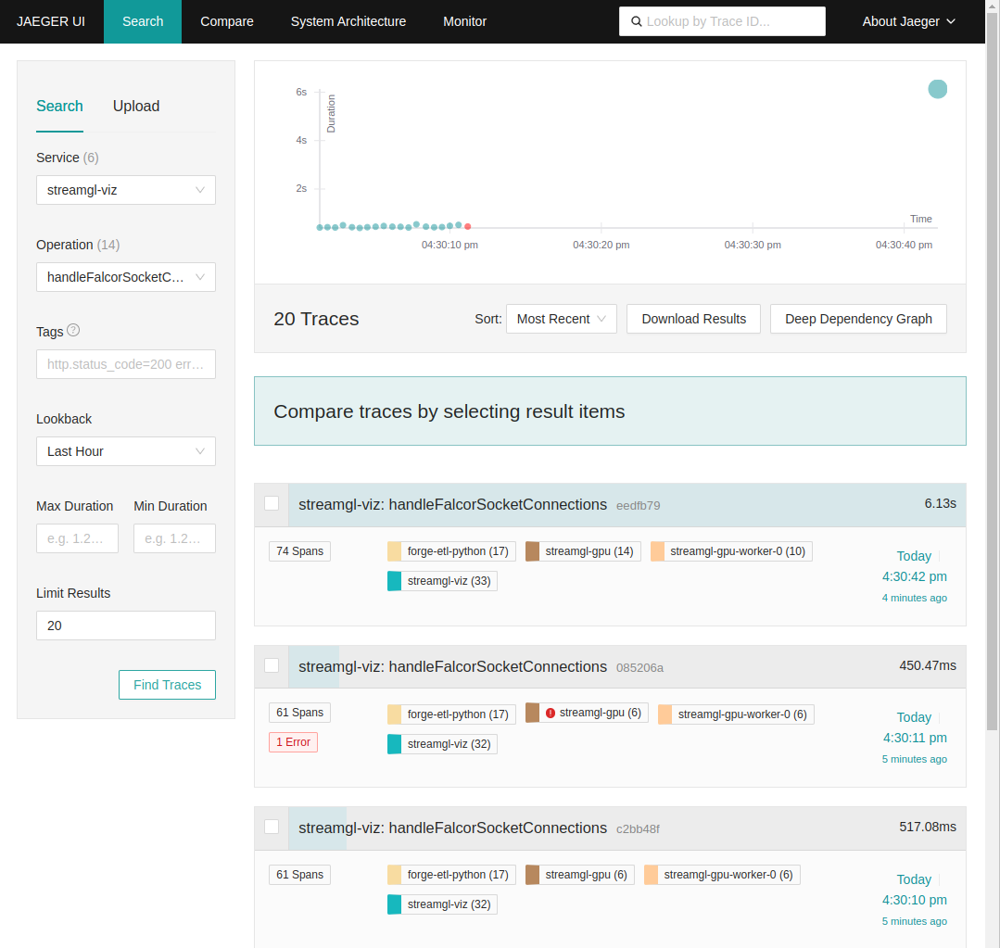
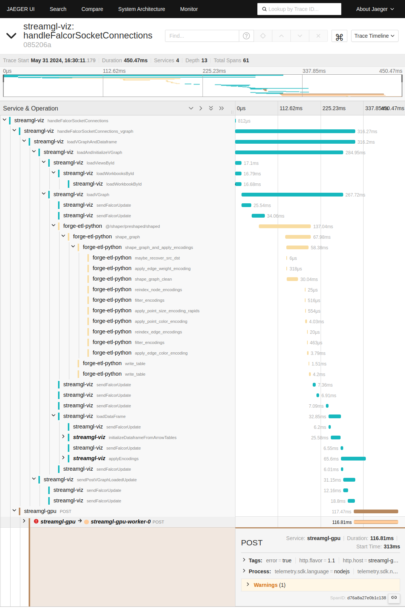
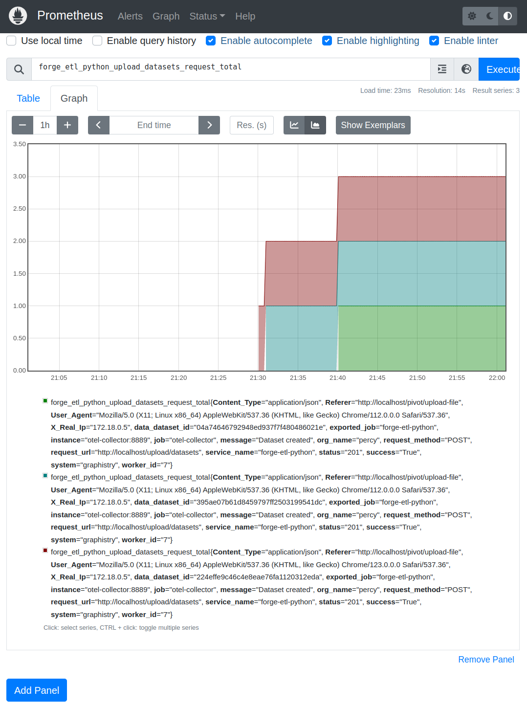
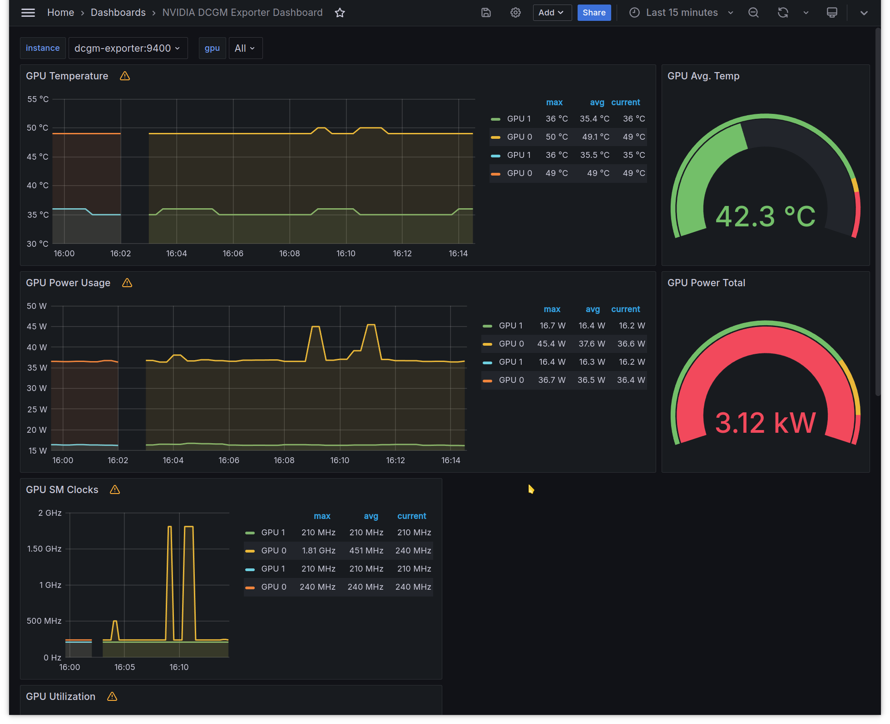

# Docker Compose Telemetry

## Overview

Graphistry services export telemetry information (metrics and traces) using the [OpenTelemetry](https://opentelemetry.io/) standard.

Graphistry services push their telemetry data to the [opentelemetry-collector](https://opentelemetry.io/docs/collector/) service (alias `otel-collector`) and this will forward the data to any observability tool that is compatible with the OpenTelemetry standard (e.g. Prometheus, Jaeger, Grafana Cloud, etc.).

## Telemetry Deployment Modes

When telemetry services are enabled, the OpenTelemetry Collector will be included in all deployment scenarios:

### Forwarding to External Services
In this mode, Graphistry forwards telemetry data to external services compatible with the OpenTelemetry Protocol (OTLP), such as Grafana Cloud.  The deployment will include only the OpenTelemetry Collector, which handles the data forwarding.

### Using Packaged Observability Tools
When using the local observability tools bundled with Graphistry —Prometheus, Jaeger, and Grafana— the OpenTelemetry Collector exports data to these services.  In this mode, you can configure Caddy to expose the observability tools to allow external access; the OpenTelemetry Collector URL won't be affected by Caddy (see [behind Caddy](#caddyfile---reverse-proxy-set-up)).  By default, the data is ephemeral, stored inside the containers, and won’t persist across restarts.  To enable data persistence, create a custom Docker Compose file named `custom_telemetry.yml` based on `telemetry.yml` or `telemetry.cloud.yml` as a reference.  In this file, configure persistent storage settings and update the environment variable `OTEL_COMPOSE_FILE` in the configuration file (`$GRAPHISTRY_HOME/data/config/telemetry.env`) to point to your `custom_telemetry.yml`.

### Hybrid Mode
This option combines both local observability tools and forwarding to external services.  The OpenTelemetry Collector is configured to export telemetry data to both local tools (Prometheus, Jaeger, Grafana) and external services (e.g., Grafana Cloud).  To enable this mode, you can create your own `custom_telemetry.yml` file as well, allowing you to configure and tailor the hybrid setup according to your specific needs.

## Usage

By default, the telemetry services are disabled. To enable, set `ENABLE_OPEN_TELEMETRY=true` in `$GRAPHISTRY_HOME/data/config/telemetry.env`.

The `./graphistry` script in $GRAPHISTRY_HOME will automatically start those services when `ENABLE_OPEN_TELEMETRY=true`.  The `./graphistry` script is a convenient wrapper around `docker compose ...`, but will not trigger telemetry collection, forwarding, nor telemetry UIs unless ENABLE_OPEN_TELEMETRY is set to true and the services are properly configured.

To start the telemetry services after setting up `ENABLE_OPEN_TELEMETRY=true`, run:
```
cd $GRAPHISTRY_HOME
./graphistry up -d
```

### Managing Individual Telemetry Services

If you need to manage individual telemetry services, you can use the following commands.  Each command starts a specific service:

```bash
# Start the Node Exporter to collect and expose system-level metrics (e.g., CPU, memory, disk, and network).
./graphistry up -d node-exporter

# Start the NVIDIA Data Center GPU Manager Exporter (DCGM Exporter) for GPU monitoring
./graphistry up -d dcgm-exporter

# Start Prometheus for metrics collection and storage
./graphistry up -d prometheus

# Start Grafana for visualization and dashboarding
./graphistry up -d grafana

# Start Jaeger for distributed tracing
./graphistry up -d jaeger

# Start the OpenTelemetry Collector for collecting and exporting telemetry data
./graphistry up -d opentelemetry-collector
```

## Accessing Telemetry Dashboards and Services
Once the services are online, we can access the next links for operations and development.

Note: If you have configured Caddy to expose the Telemetry services (see [behind Caddy](#caddyfile---reverse-proxy-set-up)), the services will have a different URL.

### OpenTelemetry Collector metrics for Prometheus
Use this URL when the service is [behind Caddy](#caddyfile---reverse-proxy-set-up): `https://$GRAPHISTRY_HOST/metrics`

Use this URL when the service is **not behind Caddy**: `https://$GRAPHISTRY_HOST:8889/metrics`

### Prometheus dashboard
Use this URL when the service is [behind Caddy](#caddyfile---reverse-proxy-set-up): `https://$GRAPHISTRY_HOST/prometheus/`

Use this URL when the service is **not behind Caddy**: `https://$GRAPHISTRY_HOST:9091/prometheus/`

### Jaeger dashboard
Use this URL when the service is [behind Caddy](#caddyfile---reverse-proxy-set-up): `https://$GRAPHISTRY_HOST/jaeger/`

Use this URL when the service is **not behind Caddy**: `https://$GRAPHISTRY_HOST:16686/jaeger/`

### Grafana dashboard
Grafana will include GPU metrics and dashboards from NVIDIA Data Center GPU Manager: `DCGM Exporter Dashboards`, as well as the Node Exporter Dashboard for system-level metrics (e.g., CPU, memory, disk, and network).
- Use this URL when the service is [behind Caddy](#caddyfile---reverse-proxy-set-up): `https://$GRAPHISTRY_HOST/grafana/`
- Use this URL when the service is **not behind Caddy**: `https://$GRAPHISTRY_HOST:3000`

## Configuration

### telemetry.env

The file `$GRAPHISTRY_HOME/data/config/telemetry.env` has the environment variables to enable and configure the telemetry services (including the `opentelemetry-collector`), by default, the file is either commented out or empty, so by default Graphistry does not collect and export OpenTelemetry data.
These are the core environment variables:

- `ENABLE_OPEN_TELEMETRY`: Supports `true` or `false`.  After setting this to `true` and restarting the deployment with `./graphistry up -d` the telemetry services will be started and the Graphistry services will export telemetry data.
- `OTEL_COMPOSE_FILE`: Specifies the Docker Compose file for telemetry services to be deployed alongside the main Graphistry Docker Compose file (`docker-compose.yml`) when `ENABLE_OPEN_TELEMETRY` is `true`.  Graphistry offers two files: `telemetry.yml` for the [Using Packaged Observability Tools mode](#using-packaged-observability-tools), which includes local telemetry tools, and `telemetry.cloud.yml` for the [Forwarding to External Services mode](#forwarding-to-external-services), which exports data to external services like Grafana Cloud.  You can also create a `custom_telemetry.yml` file for additional flexibility, such as configuring persistence in the [Using Packaged Observability Tools mode](#using-packaged-observability-tools) or combining local and external services in the [Hybrid Mode](#hybrid-mode).  The inclusion of the `OTEL_COMPOSE_FILE` is managed by the `./graphistry` script, a convenience wrapper around Docker Compose, which determines whether to include this additional telemetry Docker Compose file in the deployment.

These environment variables are used when we want to use `OTEL_COMPOSE_FILE=telemetry.yml`:
- `GF_SERVER_ROOT_URL`: Set `GF_SERVER_ROOT_URL` when using Grafana [behind Caddy](#caddyfile---reverse-proxy-set-up). The value pattern should be `http(s)://$GRAPHISTRY_HOST/grafana/`.
- `GF_SERVER_SERVE_FROM_SUB_PATH`: Set `GF_SERVER_SERVE_FROM_SUB_PATH` to `true` when using Grafana [behind Caddy](#caddyfile---reverse-proxy-set-up) (default value is `false`).

And these other environment variables are used when we want to use `OTEL_COMPOSE_FILE=telemetry.cloud.yml`:
- `OTEL_COLLECTOR_OTLP_HTTP_ENDPOINT`: For example the Grafana Cloud OTLP HTTP endpoint.
- `OTEL_COLLECTOR_OTLP_USERNAME`: For example the Grafana Cloud Instance ID for OTLP
- `OTEL_COLLECTOR_OTLP_PASSWORD`: For example the Grafana Cloud API Token for OTLP

 ### Configure Telemetry Services

The `$GRAPHISTRY_HOME/etc` has the directories to configure the Graphistry Local Telemetry Suite:
- `$GRAPHISTRY_HOME/etc/otel-collector`: Has the `otel-collector-config.cloud.yml` (when we use the `OTEL_COMPOSE_FILE=telemetry.cloud.yml`) and `otel-collector-config.yml` (`OTEL_COMPOSE_FILE=telemetry.yml`).
- `$GRAPHISTRY_HOME/etc/prometheus`: Has `prometheus.yml` to configure the Prometheus service.  By default, it is already configured to collect metrics from Graphistry services and from the `DCGM exporter` service.
- `$GRAPHISTRY_HOME/etc/jaeger`: To configure the Jaeger service.
- `$GRAPHISTRY_HOME/etc/grafana`: To configure the Grafana service.  By default, it has already configured the Prometheus service as default datasource.  Also, it has already configured and ready to use the `DCGM Exporter Dashboards`.

## Examples

### Example: Deploying with Graphana Cloud

This is the configuration template for using [Grafana Cloud](https://grafana.com/) alongside the OpenTelemetry Collector:

```bash
ENABLE_OPEN_TELEMETRY=true

OTEL_COMPOSE_FILE=telemetry.cloud.yml

OTEL_COLLECTOR_OTLP_HTTP_ENDPOINT="https://hostname.grafana.net/otlp"   # e.g. Grafana OTLP HTTP endpoint
OTEL_COLLECTOR_OTLP_USERNAME="XYZ"   # e.g. Grafana Cloud Instance ID for OTLP
OTEL_COLLECTOR_OTLP_PASSWORD="PQR"   # e.g. Grafana Cloud API Token for OTLP
```

### Example: Deploying with the Packaged Graphistry Local Telemetry Suite

This is the configuration template for using the Graphistry Local Telemetry Suite alongside the OpenTelemetry Collector:

```bash
ENABLE_OPEN_TELEMETRY=true

OTEL_COMPOSE_FILE=telemetry.yml
```

### Example: Deploying with the Packaged Graphistry Local Telemetry Suite behind Caddy

This is the configuration template for using the Graphistry Local Telemetry Suite alongside the OpenTelemetry Collector and running all the telemetry services [behind Caddy](#caddyfile---reverse-proxy-set-up).  Replace `$GRAPHISTRY_HOST` with the domain or IP address where Graphistry is running, and use `https` or `http` as required:

```bash
ENABLE_OPEN_TELEMETRY=true

OTEL_COMPOSE_FILE=telemetry.yml

# Set GF_SERVER_ROOT_URL to the URL where Grafana is accessible behind Caddy
GF_SERVER_ROOT_URL=http(s)://$GRAPHISTRY_HOST/grafana/

# Set GF_SERVER_SERVE_FROM_SUB_PATH to true when using Grafana behind Caddy
GF_SERVER_SERVE_FROM_SUB_PATH=true
```

## Key Telemetry Features

### Tracing
The most critical flow instrumented is the graph rendering flow:
- **Flow Initiation:** Starts in the web browser when opening a dataset URL (example: `http://$GRAPHISTRY_HOST/graph/graph.html?dataset=d9fc0b023278494583a526f0a35771f0`).
- **Root Span Creation:** The visualization service (`streamgl-viz`) creates a root span containing metadata like user ID, dataset ID, and graph session ID.
- **Trace Propagation:** The trace context propagates from the web browser to the GPU workers, which create spans for various actions (e.g., play, read, stop).
- **Data Fetching:** Both the visualization service and GPU workers (`streamgl-gpu`) fetch dataset data from the python ETL service (`forge-etl-python`).

**Use Case:**
- **Error Identification:** The trace information provides a detailed view across the frontend (web browser), visualization service, GPU workers, and the python ETL service, helping identify performance bottlenecks and errors.
- **Bottleneck Identification:** The trace information also provides a some insights about latency issues and other performance problems that may affect the graph redenering flow.

### Metrics
Metrics are implemented for critical errors and service health, where each metric can include lots of useful metadata (user id, graph session id, dataset id, etc.):
- **GPU Workers:** Monitor `worker.read.crashes` counter for crash incidents.
- **Python ETL Service:** Track file uploads and dataset creation activities.

**Use Case:**
- **Error Monitoring:** Increase visibility into critical errors, such as GPU worker crashes.
- **Dataset Monitoring:** Gather insights into ETL operations like file uploads and dataset creations.

## How to Use the Telemetry Data

When enabled, telemetry sent to the local Graphistry [OTEL Collector](https://opentelemetry.io/docs/collector/) service, and from there, dispatches to any observability tool that is compatible with the OpenTelemetry standard (e.g. Prometheus, Jaeger, Grafana Cloud, etc.).

To use telemetry with Graphistry, you need to:

* Enable telemetry collection recording in one or more Graphistry services
* Configure which users each service will monitor (see section on feature flags)
* Enable the telemetry collector service
* Configure the forwarding from the telemetry collector to an observability database/UI
* Optionally, setup a local observability database/UI

### Accessing Traces

1. **Jaeger Dashboard:** Access the [Jaeger Dashboard URL](#jaeger-dashboard).
2. **Key Tracing Information:**
   - List of traces generated by the system for the graph rendering flow (for instance: show the trace list including a trace with errors).



   - The root span for the graph rendering flow is `streamgl-viz: handleFalcorSocketConnections`.
   - The service that generates the root span for the graph rendering flow is `streamgl-viz`.
   - ETL dataset fetch spans from the Python ETL Service service.
   - Detailed spans for actions by the visualization service and GPU workers (for instance: inspecting trace with error).


### Accessing Metrics
1. **Prometheus Dashboard:** Access the [Prometheus Dashboard URL](#prometheus-dashboard).
2. **Critical Metrics to Monitor:**
   - `worker_read_crashes_total`: Monitor GPU worker crashes.
   - File upload and dataset creation metrics in the Python ETL service (all metrics with the name `forge_etl_python_upload_*`, for instance: `forge_etl_python_upload_datasets_request_total`).


### GPU Monitoring with Grafana and NVIDIA Data Center GPU Manager

To provide comprehensive monitoring of GPU performance, we utilize Grafana in conjunction with NVIDIA Data Center GPU Manager (DCGM).  These tools enable real-time visualization and analysis of GPU metrics, ensuring optimal performance and facilitating troubleshooting.
- **NVIDIA Data Center GPU Manager (DCGM):** [DCGM](https://developer.nvidia.com/dcgm) is a suite of tools for managing and monitoring NVIDIA GPUs in data centers.  It provides detailed metrics on GPU performance, health, and utilization.
- **Grafana:** Grafana is an open-source platform for monitoring and observability.  It allows users to query, visualize, alert on, and explore metrics from a variety of data sources, including Prometheus.  By default the Grafana instance has the metrics and GPU dashboard from the `DCGM exporter` service (see `DCGM Exporter Dashboards` in the Grafana main page).



## Advanced configuration

### Caddyfile - reverse proxy set up

To acces the telemetry services, you need to use the template file `$GRAPHISTRY_HOME/data/config/Caddyfile.otel-setup` for the caddy configuration.

1. Create a backup copy of you current Caddyfile: `$GRAPHISTRY_HOME/data/config/Caddyfile`
2. Create a new `$GRAPHISTRY_HOME/data/config/Caddyfile` using the template provided at `$GRAPHISTRY_HOME/data/config/Caddy.default`.  Update the template with your own domain or IP address.  For example, if the template uses `$GRAPHISTRY_HOST`, replace it with your actual domain or IP (e.g., `your-domain.grph.xyz`).  Remember to use your specific domain or IP address instead of the example.  The following section will show the contents of the new Caddyfile for reference.

```
   your-domain.grph.xyz, :80 {

       log {
         level DEBUG
       }

       @mismatchedHost {
           not host your-domain.grph.xyz localhost
       }
       handle @mismatchedHost {
           respond 400
       }

       respond /caddy/health/ 200

       handle /jaeger* {
           reverse_proxy jaeger:16686
       }

       # Route to prometheus
       handle /prometheus* {
           reverse_proxy prometheus:9090
       }

       # Routes for Grafana
       handle /grafana* {
           reverse_proxy grafana:3000
       }

       # Default reverse proxy for all other paths
       reverse_proxy nginx:80 {
           header_down Strict-Transport-Security max-age=2592000;
       }

   }
```

3. Set the following environment variables in `$GRAPHISTRY_HOME/data/config/telemetry.env` (as shown in [this example](#example-deploying-with-the-packaged-graphistry-local-telemetry-suite-behind-caddy) as well): `GF_SERVER_ROOT_URL=http(s)://your-domain.grph.xyz/grafana/` (use https or http depending on your deployment) and `GF_SERVER_SERVE_FROM_SUB_PATH=true`.  Replace `your-domain.grph.xyz` with your actual domain or IP address, as appropriate.
4. Restart `caddy` with:
   ```bash
   cd $GRAPHISTRY_HOME
   ./graphistry up -d --force-recreate caddy
   ```
5. Access the telemetry services and dashboards. For details, refer to the sections on [accessing telemetry services](#accessing-telemetry-dashboards-and-services) and [using the dashboards](#how-to-use-the-telemetry-data).

### Audience selection via feature flags

The feature flag in the web admin panel (waffle) for OpenTelemetry is `flag_ot_traces`, and it is off by default

You need to be admin in order to change its value, this flag controls at runtime which users can export telemetry data.  You can set monitoring to no/all/select users.
