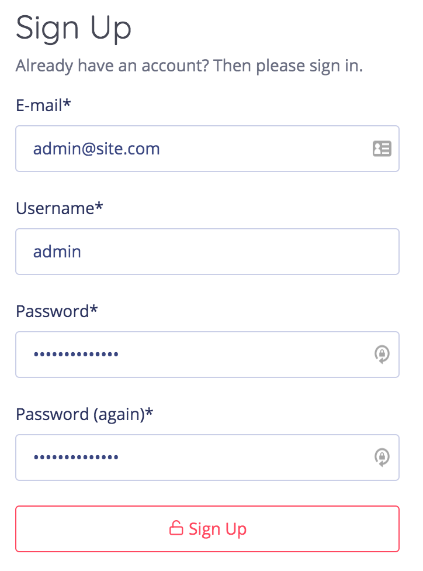
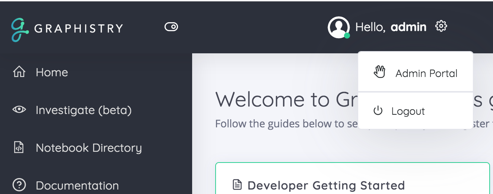
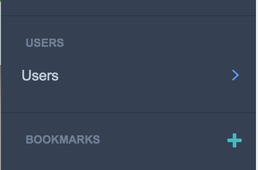
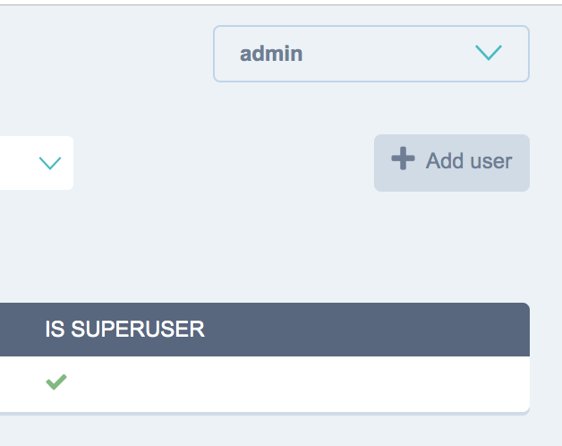
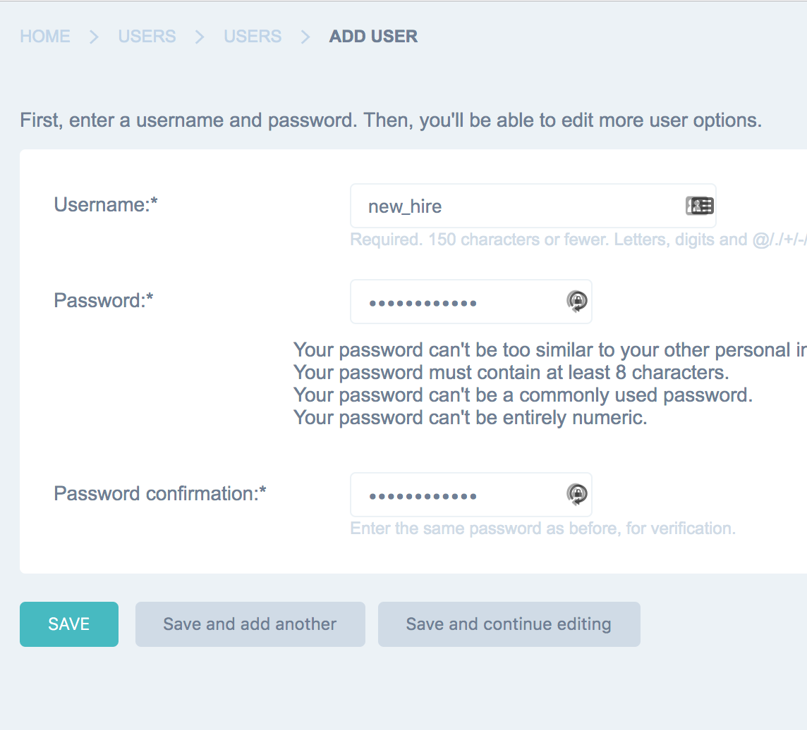
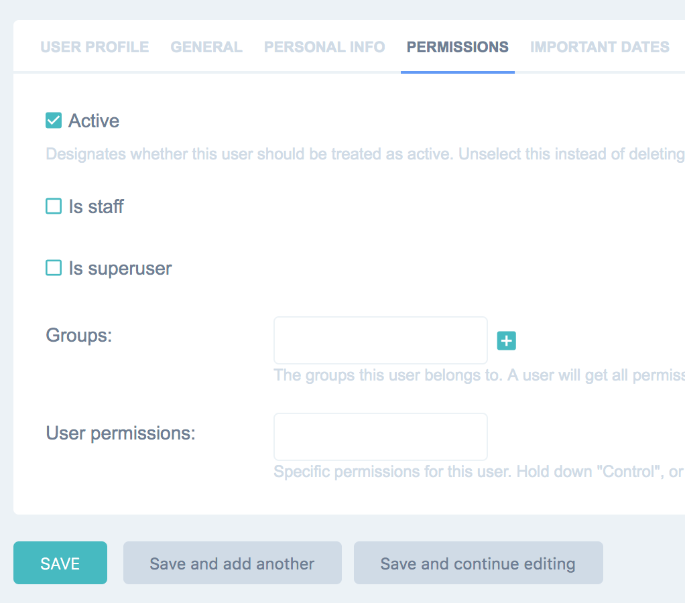

# User Creation

## Account Creation Model

* Graphistry temporarily starts with **Open Registration**
* The first user to register automatically gains the **superuser** and **staff** roles, and the system automatically switches to **Invite-Only**
* **superuser** users can create new users and assign them roles, including **superuser** and **staff**
* Every user gets an **API key** for creating visualizations
* **staff** users also get access to the shared Jupyter notebook server and the team investigation automation tool
* **superuser** users can also turn open registration back on, and give newly self-registered users the role **staff**

## Create Initial User: Admin 1

| Step | Diagram |
| ---: | :------ |
| Upon starting Graphistry the first time, simply sign up. Take care to record your login/pwd. |  |

## Create Subsequent Users & Roles

| Step | Diagram |
| ---: | :----- |
| Go to the **Admin Portal**    |      |
| Open the **Users** manager    |  |
| **Add user**                  |   |
| Set **Username**/**Password** |  |
| **Save and continue editing** |                                            |
| Set **Permissions**, typically unchecking **staff** and **superuser** |  |
| **Save**                      |                                            |

Congrats, your user can now log in!

## Provide API Keys

* Every user gets an API key on their dashboard page
* Additional API keys can be generated via [CLI commands](../README.md)
* API keys are not currently revocable
* To preserve API keys across installations, make sure to copy `.env`

Note that Graphistry is moving to JWT-based authentication. The user dashboard also gives access to a JWT-based API keys.

## Enable Open Registration

To allow users to self-register, in the admin panel's constance configuration, enable `IS_SIGNUPS_OPEN_AFTER_FIRST`

For new users to gain access to the team notebook server and the investigation tool, you will need to give them **staff** permissions.

